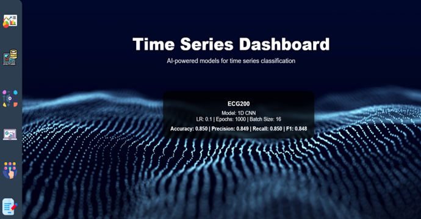

# Time-Series-Classification-with-Deep-Learning

This project focuses on a comparative study of deep learning architectures for **Time Series Classification (TSC)** and includes an **interactive web application** for real-time model experimentation and visualisation.


## 📌 Project Overview

This project performs a **systematic comparison of three state-of-the-art deep learning models**:

* **1D Convolutional Neural Network (1D CNN)**
* **Transformer (Self-Attention based)**
* **InceptionTime (Multi-scale CNN Ensemble)**

The models are evaluated on benchmark datasets from the **UCR Time Series Archive**, using both **threshold-dependent** and **threshold-independent** metrics. To enhance transparency and reproducibility, the project also delivers a **Flask-based interactive web dashboard** that allows users to train models and visualise results dynamically.

## 🎯 Key Objectives

* Compare the performance of 1D CNN, Transformer, and InceptionTime on diverse time-series datasets
* Analyse model behaviour under **balanced vs imbalanced data**
* Study the impact of **hyperparameters** (learning rate, epochs, batch size)
* Go beyond accuracy by using **Precision, Recall, F1-score, and PR curves**
* Build an **interactive web application** for model selection and experimentation

## 📂 Datasets Used (UCR Archive)

| Dataset          | Task        | Time Steps | Classes | Characteristics                         |
| ---------------- | ----------- | ---------- | ------- | --------------------------------------- |
| ItalyPowerDemand | Binary      | 24         | 2       | Balanced, short sequences               |
| ECG200           | Binary      | 96         | 2       | Small & imbalanced ECG signals          |
| CinCECGTorso     | Multi-class | 1639       | 4       | Long, noisy, highly imbalanced ECG data |

All datasets follow the **canonical train/test splits** provided by UCR and are preprocessed using **per-sample z-score normalisation**.


## 🧠 Model Architectures

### 1️⃣ 1D CNN

* Captures **local temporal dependencies** using convolutional filters
* Dataset-specific architectural tuning
* Dropout, Batch Normalisation, and deeper stacks used for robustness

### 2️⃣ Transformer

* Utilises **self-attention** to model long-range dependencies
* Sinusoidal positional encoding
* Faster convergence on complex and imbalanced datasets

### 3️⃣ InceptionTime

* Ensemble-based architecture with **multi-scale convolution kernels**
* Strong performance on small and imbalanced datasets
* Benchmark-level accuracy on UCR datasets


## ⚙️ Training & Evaluation

### Training Setup

* Framework: **TensorFlow / Keras**
* Optimiser: **Adam**
* Loss Functions:

* Binary Cross-Entropy (binary tasks)
* Categorical Cross-Entropy (multi-class task)
* Class imbalance handled using **class weights**

### Hyperparameter Search Space

* Learning Rate: `0.1`, `0.01`, `0.001`
* Epochs: `100`, `500`, `1000`
* Batch Size: `8`, `16`, `32`

A total of **27 configurations per model per dataset** were explored.

### Evaluation Metrics

* Accuracy
* Precision
* Recall
* F1-score
* **Precision–Recall (PR) Curves & AUPRC**

PR curves were used extensively to analyse model behaviour across decision thresholds, especially under class imbalance.

## 📊 Key Results (Summary)

* **ItalyPowerDemand (Balanced):**

  * Transformer achieved highest accuracy with faster convergence
  * All models performed comparably

* **ECG200 (Imbalanced, Small):**

  * InceptionTime achieved the best F1 and AUPRC
  * Transformer underperformed due to limited data size

* **CinCECGTorso (Multiclass, Long Sequences):**

  * 1D CNN emerged as the most robust model
  * Transformer showed competitive performance with fewer epochs
  * InceptionTime struggled with high variability

## 🌐 Interactive Web Application

An integral part of this project is an **AI-powered Time Series Dashboard**, developed using **Flask**.

### Sample Output (Web Application)
Below is a snapshot of the web interface displaying model performance metrics
(Accuracy, Precision, Recall, and F1-score) after training:



### 🔹 Features

* Dataset selection (ItalyPowerDemand, ECG200, CinCECGTorso)
* Model selection (1D CNN, Transformer, InceptionTime)
* Hyperparameter tuning from UI
* Real-time model training
* Display of performance metrics (Accuracy, Precision, Recall, F1)
* Visualisation of average waveforms
* Reload previously trained models without retraining

## 🗂 Repository Structure

```
├── notebooks/
│   ├── ItalyPowerDemand.ipynb
│   ├── ECG200.ipynb
│   ├── CinCECGTorso.ipynb
│
├── web_app/
│   ├── app.py
│   ├── templates/
│   ├── static/
│
├── README.md
```

## 🛠 Tools & Technologies

* Python 3.11
* TensorFlow / Keras
* Scikit-learn
* sktime
* NumPy, Pandas
* Matplotlib, Seaborn
* Flask (Web Application)


## ⚠️ Disclaimer

This project is intended **strictly for academic and research purposes**. The models and application are not clinically validated and should not be used in real-world medical or industrial deployments without further validation.


⭐ If you find this project useful or interesting, feel free to star the repository!
